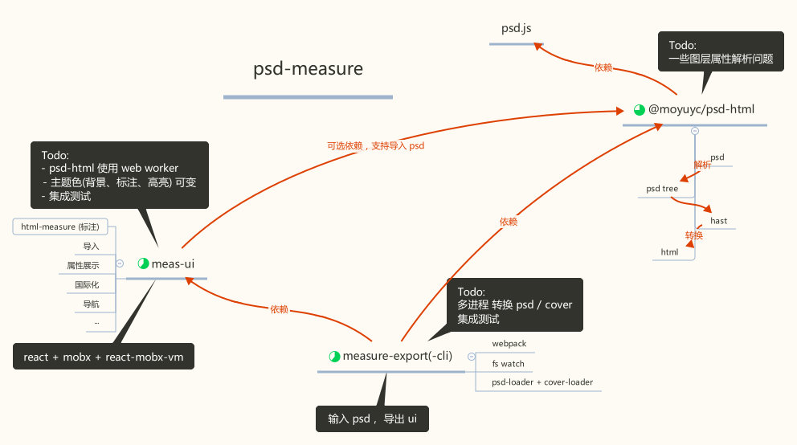

<p align="center">
  
</p>
<h3 align="center">measure</h3>
<p align="center">
  <a href="https://travis-ci.org/imcuttle/measure"></a>
  <a href="https://codecov.io/github/imcuttle/measure?branch=master"></a>
  <a href="https://prettier.io/"></a>
  <a href="https://conventionalcommits.org"></a>
</p>
<p align="center">Open source Project for Measure (psd) easily</p>


- [Live Demo](https://imcuttle.github.io/measure)
- [中文文章](https://imcuttle.github.io/make-psd-measurable)

## Getting started

```bash
npm i measure-export-cli -g
# Run the online server
measure-export start path/to/psdDir
# Build assets in $PWD/dist
measure-export build path/to/psdDir

measure-export --help
measure-export start --help
measure-export build --help
```

## Processor about the monorepo



## TODO

- [ ] integration tests should be applied on ui and cli

## Packages

- [chrome-extension-measure-viewer](packages/chrome-extension-measure-viewer) - PSD measure viewer
- [html-measure](packages/html-measure) - Make html to be measurable written by React
- [meas-ui](packages/meas-ui) - Measure UI for making PSD/SVG/HTML to be measurable
- [measure-export](packages/measure-export) - Make measure UI exported for teamwork
- [measure-export-cli](packages/measure-export-cli) - Command line for measure export
- [@moyuyc/psd-html](packages/psd-html) - Make it a fun to create spec by psd for developers and teammates

## Related

- [sketch measure](https://github.com/utom/sketch-measure) - Make it a fun to create spec for developers and teammates
- [psd.js](https://github.com/meltingice/psd.js) - A Photoshop PSD file parser for NodeJS and browsers

## Developing

- Install dependencies

  ```bash
  npm install
  ```

- This repo use lerna for managing multiply packages, so need to bootstrap dependencies of each package.

  ```bash
  npx lerna bootstrap
  ```

## Contributing

- Fork it!
- Create your new branch:  
  `git checkout -b feature-new` or `git checkout -b fix-which-bug`
- Start your magic work now
- Make sure npm test passes
- Commit your changes:  
  `git commit -am 'feat: some description (close #123)'` or `git commit -am 'fix: some description (fix #123)'`
- Push to the branch: `git push`
- Submit a pull request :)

## Authors

This library is written and maintained by imcuttle, [moyuyc95@gmail.com](mailto:moyuyc95@gmail.com).

## License

MIT
